# Architecture Decision Record: Git CMS
## Database-Free Content Management via Git Plumbing

**Status:** Active
**Version:** 1.0.0
**Last Updated:** 2026-01-11
**Author:** James Ross

---

## 1. Introduction & Goals

### Project Overview

**git-cms** is a serverless, database-free Content Management System that treats Git's object store as a distributed, cryptographically verifiable document database. Instead of storing content in traditional databases (SQL or NoSQL), it leverages Git's Merkle DAG to create an append-only ledger for articles, metadata, and encrypted assets.

The fundamental innovation: **`git push` becomes the API endpoint.**

### Fundamental Requirements

#### FR-1: Zero-Database Architecture
The system MUST NOT depend on external database systems (SQL, NoSQL, or key-value stores). All persistent state resides within Git's native object store (`.git/objects`).

**Rationale:** Eliminates operational complexity, deployment dependencies, and schema migration challenges inherent to traditional database-backed CMSs.

#### FR-2: Cryptographic Verifiability
Every content mutation MUST be recorded as a Git commit with cryptographic integrity guarantees via Git object hashing (SHA-1 in default object-format mode, with optional GPG signing for non-repudiation).

**Rationale:** Provides immutable audit trails and tamper detection without additional infrastructure.

#### FR-3: Fast-Forward Only Publishing
The publish operation MUST enforce strict linear history (fast-forward only) to prevent rewriting published content.

**Rationale:** Guarantees provenance and prevents content manipulation after publication.

#### FR-4: Client-Side Encryption
All uploaded assets MUST be encrypted client-side (AES-256-GCM) before touching the repository.

**Rationale:** Achieves row-level security without database-level access controls. The Git gateway receives only opaque encrypted blobs.

#### FR-5: Infinite Point-in-Time Recovery
Users MUST be able to access any historical version of any article without data loss.

**Rationale:** Git's DAG structure provides this naturally; the CMS simply exposes it as a first-class feature.

### Quality Goals

| Priority | Quality Attribute | Description | Measurement |
|----------|------------------|-------------|-------------|
| 1 | **Security** | Cryptographic integrity, client-side encryption, signed commits | GPG verification, AES-256-GCM encryption strength |
| 2 | **Simplicity** | Minimal dependencies, no database, composable architecture | Lines of code, dependency count, Docker image size |
| 3 | **Auditability** | Complete provenance of all content changes | Git log completeness, trailer metadata coverage |
| 4 | **Performance** | Sub-second reads for typical blog workloads | Response time for `readArticle()` |
| 5 | **Portability** | Multi-runtime support (Node, Bun, Deno) | Test suite pass rate across runtimes |

### Non-Goals

This system is **intentionally NOT designed for**:

- **High-velocity writes:** Content publishing happens in minutes/hours, not milliseconds.
- **Complex queries:** No SQL-like JOINs or aggregations. Queries are limited to ref enumeration and commit message parsing.
- **Large-scale collaboration:** Designed for single-author or small-team blogs, not Wikipedia-scale editing.
- **Real-time updates:** Publishing is atomic but not instantaneous across distributed clones.

---

## 2. Constraints

### Technical Constraints

#### TC-1: Git's Content Addressability Model
Git uses object-format-dependent hashing for object addressing (SHA-1 in default mode; SHA-256 in SHA-256 repos). While SHA-1 has known collision vulnerabilities, Git is transitioning to SHA-256. This ADR currently documents behavior assuming default SHA-1 object format unless explicitly stated otherwise.

**Mitigation:** Use GPG signing (`CMS_SIGN=1`) for cryptographic non-repudiation.

#### TC-2: Filesystem I/O Performance
All Git operations are ultimately filesystem operations. Performance is bounded by disk I/O, especially for large repositories.

**Mitigation:** Content is stored as commit messages (small), not files (large). Asset chunking (256KB) reduces blob size.

#### TC-3: POSIX Shell Dependency
The `@git-stunts/plumbing` module executes Git via shell commands (`child_process.spawn`). This requires a POSIX-compliant shell and Git CLI.

**Mitigation:** All tests run in Docker (Alpine Linux) to ensure consistent environments.

#### TC-4: No Database Indexes
Traditional databases provide B-tree indexes for fast lookups. Git's ref enumeration is linear (`O(n)` for listing all refs in a namespace).

**Mitigation:** Use ref namespaces strategically (e.g., `refs/_blog/articles/<slug>`) to avoid polluting the global ref space.

### Regulatory Constraints

#### RC-1: GDPR Right to Erasure
Git's immutability conflicts with GDPR's "right to be forgotten." Deleting a commit requires rewriting history, which breaks cryptographic integrity.

**Mitigation:** Use encrypted assets with key rotation. Deleting the encryption key renders historical content unreadable without altering Git history.

#### RC-2: Cryptographic Export Restrictions
AES-256-GCM encryption may face export restrictions in certain jurisdictions.

**Mitigation:** The `@git-stunts/vault` module uses Node's built-in `crypto` module, which is widely available.

### Operational Constraints

#### OC-1: Single-Writer Assumption
Git's ref updates are atomic *locally* but not across distributed clones. Concurrent writes to the same ref can cause conflicts.

**Mitigation:** Use **git-stargate** (a companion project) to enforce serialized writes via SSH.

#### OC-2: Repository Growth
Every draft save creates a new commit. Repositories can grow unbounded over time.

**Mitigation:** Use `git gc` aggressively. Consider ref pruning for old drafts.

---

## 3. Context & Scope

### System Context Diagram

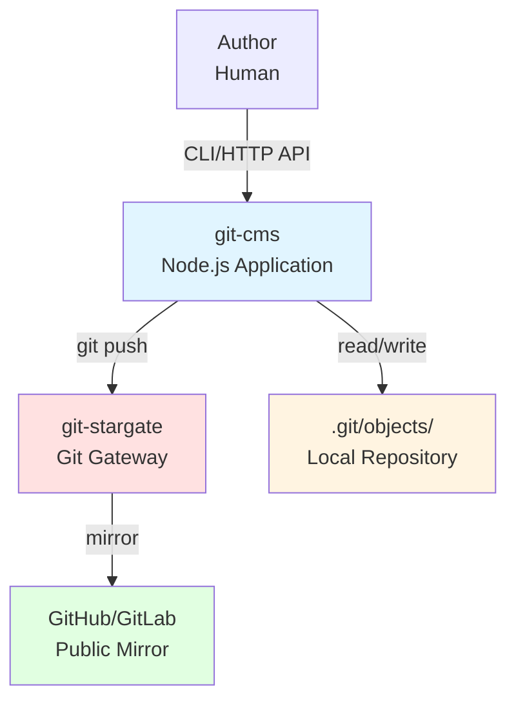

### External Interfaces

#### Interface 1: CLI (Binary)
- **Entry Point:** `bin/git-cms.js`
- **Commands:** `draft`, `publish`, `list`, `show`, `serve`
- **Protocol:** POSIX command-line arguments
- **Example:**
  ```bash
  echo "# Hello World" | git cms draft hello-world "My First Post"
  ```

#### Interface 2: HTTP API (REST)
- **Server:** `src/server/index.js`
- **Port:** 4638 (configurable via `PORT` env var)
- **Endpoints:**
  - `POST /api/cms/snapshot` – Save draft
  - `POST /api/cms/publish` – Publish article
  - `GET /api/cms/list` – List articles
  - `GET /api/cms/show?slug=<slug>` – Read article
- **Authentication:** None in core service (local/trusted network assumption). Deployments should add network controls and authenticated gateways for write endpoints.

#### Interface 3: Git Plumbing (Shell)
- **Protocol:** Git CLI commands via `child_process.spawn`
- **Critical Commands:**
  - `git commit-tree` – Create commits on empty trees
  - `git update-ref` – Atomic ref updates
  - `git for-each-ref` – List refs in namespace
  - `git cat-file` – Read commit messages

#### Interface 4: OS Keychain (Secrets)
- **Platforms:**
  - macOS: `security` command-line tool
  - Linux: `secret-tool` (GNOME Keyring)
  - Windows: `CredentialManager` (PowerShell)
- **Purpose:** Store AES-256-GCM encryption keys for assets

### Scope Boundaries

#### In Scope
- Article drafting, editing, and publishing
- Encrypted asset storage (images, PDFs)
- Full version history via Git log
- CLI and HTTP API access
- Multi-runtime support (Node, Bun, Deno)

#### Out of Scope
- **User Authentication:** Delegated to git-stargate or SSH
- **Search Indexing:** No full-text search (could be built via external indexer reading Git log)
- **Media Transcoding:** Assets stored as-is (no ImageMagick, FFmpeg)
- **Real-Time Collaboration:** No operational transformation (OT) or CRDTs
- **Analytics:** No built-in pageview tracking

---

## 4. Solution Strategy

### Core Architectural Principles

#### P-1: Composition over Inheritance
The system is built from **five independent "Lego Block" modules** (`@git-stunts/*`), each with a single responsibility. These modules are composed in `CmsService` to create higher-order functionality.

**Benefit:** Each module can be tested, versioned, and published independently.

#### P-2: Hexagonal Architecture (Ports & Adapters)
The domain layer (`CmsService`) depends on abstractions (`GitPlumbing`, `TrailerCodec`), not implementations. This allows swapping out Git for other backends (e.g., a pure JavaScript implementation for testing).

**Benefit:** Decouples domain logic from infrastructure concerns.

#### P-3: Content Addressability
Assets are stored by object hash, enabling automatic deduplication. In SHA-1 object-format mode this is a SHA-1 hash; in SHA-256 mode it is SHA-256.

**Benefit:** Reduces repository bloat.

#### P-4: Cryptographic Integrity
Every operation produces a cryptographically signed commit (when `CMS_SIGN=1`). The Merkle DAG ensures tamper detection.

**Benefit:** Audit trails are mathematically verifiable, not just trust-based.

### Solution Approach: The "Empty Tree" Stunt

#### The Problem
Traditional CMSs store content in database rows. Git is designed to track *files*, not arbitrary data. Storing blog posts as files (e.g., `posts/hello-world.md`) clutters the working directory and causes merge conflicts.

#### The Solution
Store content as **commit messages on empty trees**, not as files. Every article is a commit that points to the empty tree object for the repository object format (`4b825dc642cb6eb9a060e54bf8d69288fbee4904` in SHA-1 mode).

**How It Works:**
1. Encode the article (title, body, metadata) into a Git commit message using RFC 822 trailers.
2. Create a commit that points to the empty tree (no files touched).
3. Update a ref (e.g., `refs/_blog/articles/hello-world`) to point to this commit.

**Result:** The repository's working directory remains clean. All content lives in `.git/objects/` and `.git/refs/`.

#### Architectural Pattern: Event Sourcing
Each draft save creates a new commit. The "current" article is the ref's tip, but the full history is a linked list of commits.

**Benefit:** Point-in-time recovery is trivial (`git log refs/_blog/articles/<slug>`).

### Key Design Decisions

#### D-1: Why Commit Messages, Not Blobs?
**Alternative:** Store articles as Git blobs and reference them via trees.

**Decision:** Use commit messages.

**Rationale:**
- Commits have parent pointers (enabling version history).
- Commits support GPG signing (enabling non-repudiation).
- Blobs are opaque; commit messages are human-readable.

#### D-2: Why Trailers, Not JSON in Commit Messages?
**Alternative:** Store `{"title": "Hello", "body": "..."}` as the commit message.

**Decision:** Use RFC 822 trailers (inspired by Linux kernel `Signed-off-by` footers).

**Rationale:**
- Trailers are Git-native (supported by `git interpret-trailers`).
- They're human-readable and diff-friendly.
- Backward parser is more efficient than Git's own parser.

#### D-3: Why Encrypt Assets, Not Entire Repos?
**Alternative:** Use `git-crypt` to encrypt the entire repository.

**Decision:** Encrypt individual assets client-side.

**Rationale:**
- `git-crypt` requires shared keys across all collaborators.
- Client-side encryption enables row-level access control (different keys for different assets).
- The gateway (git-stargate) never sees plaintext.

---

## 5. Building Block View

### Level 1: System Decomposition

```mermaid
graph TD
    subgraph "git-cms Application Layer"
        CLI[CLI<br/>bin/git-cms.js]
        HTTP[HTTP Server<br/>src/server/index.js]
        CMS[CmsService<br/>src/lib/CmsService.js]
    end

    subgraph "Lego Blocks (@git-stunts)"
        Plumbing[@git-stunts/plumbing<br/>Git Protocol Wrapper]
        Codec[@git-stunts/trailer-codec<br/>RFC 822 Parser]
        Graph[@git-stunts/git-warp<br/>Graph DB Primitive]
        CAS[@git-stunts/git-cas<br/>Content Store]
        Vault[@git-stunts/vault<br/>Secret Management]
    end

    CLI --> CMS
    HTTP --> CMS
    CMS --> Plumbing
    CMS --> Codec
    CMS --> Graph
    CMS --> CAS
    CMS --> Vault
    Graph --> Plumbing
    CAS --> Plumbing

    style CMS fill:#e1f5ff
    style Plumbing fill:#fff4e1
    style Codec fill:#fff4e1
    style Graph fill:#fff4e1
    style CAS fill:#fff4e1
    style Vault fill:#fff4e1
```

### Level 2: Lego Block APIs

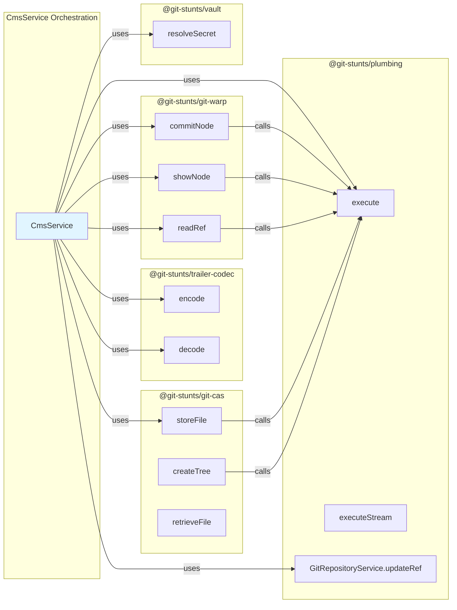

### Level 2: Lego Block Responsibilities

#### Module 1: `@git-stunts/plumbing` (v2.8.0)
**Purpose:** Low-level Git protocol implementation.

**Public API:**
```javascript
class GitPlumbing {
  async execute({ args }) // Run arbitrary Git command
  async executeStream({ args, input }) // Stream-first command execution
}

class GitRepositoryService {
  async revParse({ revision }) // Resolve ref → SHA
  async updateRef({ ref, newSha, oldSha }) // Atomic compare-and-swap
}
```

**Key Characteristics:**
- Stream-first (async iterators for large outputs)
- Shell-based (no `libgit2` or `nodegit` dependencies)
- Multi-runtime (Node, Bun, Deno)

**Boundary:** Abstracts `child_process.spawn` and stderr parsing.

---

#### Module 2: `@git-stunts/trailer-codec` (v2.1.1)
**Purpose:** Encode/decode RFC 822 trailers in commit messages.

**Public API:**
```javascript
class TrailerCodec {
  encode({ title, body, trailers }) // → message string
  decode(message) // → { title, body, trailers }
}
```

**Example:**
```
Input: { title: "Hello", body: "World", trailers: { Status: "draft" } }
Output:
  # Hello

  World

  Status: draft
```

**Key Algorithm:**
- **Backward parser:** Walks from end of message, stops at first non-trailer line.
- **Normalization:** Lowercases trailer keys (like Git).

**Boundary:** Encapsulates commit message parsing logic.

---

#### Module 3: `@git-stunts/git-warp` (v10.4.2)
**Purpose:** Graph database primitive using commits on empty trees.

**Public API:**
```javascript
class GitGraphAdapter {
  async commitNode({ message, parents, sign })
  async showNode(sha) // Returns commit message
  async readRef(ref) // Resolve ref -> SHA or null
}
```

**Implementation:**
```javascript
async commitNode({ message, parents = [], sign = false }) {
  const parentArgs = parents.flatMap((p) => ['-p', p]);
  const signArgs = sign ? ['-S'] : [];
  const oid = await this.plumbing.execute({
    args: ['commit-tree', this.emptyTree, ...parentArgs, ...signArgs, '-m', message],
  });
  return oid.trim();
}
```

**Key Insight:** By pointing all commits at the empty tree, the working directory never changes.

**Boundary:** Abstracts the "empty tree trick."

---

#### Module 4: `@git-stunts/git-cas` (v3.0.0)
**Purpose:** Content-Addressable Store for large files.

**Public API:**
```javascript
class ContentAddressableStore {
  async storeFile({ filePath, slug, filename, encryptionKey })
  async createTree({ manifest }) // Returns tree OID
  async retrieveFile({ manifest, outputPath, decryptionKey })
}
```

**Architecture:**
1. **Chunking:** Split file into 256KB chunks.
2. **Encryption:** AES-256-GCM per chunk (if key provided).
3. **Storage:** Write chunks as Git blobs.
4. **Manifest:** CBOR-encoded list of `{ oid, iv, authTag }`.

**Example Manifest:**
```javascript
{
  slug: 'hello-world',
  filename: 'hero.png',
  chunks: [
    { oid: 'abc123...', iv: '...', authTag: '...' },
    { oid: 'def456...', iv: '...', authTag: '...' }
  ]
}
```

**Boundary:** Handles encryption, chunking, and blob creation.

---

#### Module 5: `@git-stunts/vault` (v1.0.0)
**Purpose:** OS keychain integration for secrets.

**Public API:**
```javascript
class Vault {
  resolveSecret({ envKey, vaultTarget })
  // Returns secret from process.env[envKey] or OS keychain
}
```

**Keychain Targets:**
- macOS: `security find-generic-password -s <target> -w`
- Linux: `secret-tool lookup service <target>`
- Windows: `Get-Credential` (PowerShell)

**Boundary:** Abstracts OS-specific secret retrieval.

---

### Level 3: CmsService (Domain Orchestrator)

**File:** `src/lib/CmsService.js`

**Constructor:**
```javascript
constructor({ cwd, refPrefix }) {
  this.plumbing = new GitPlumbing({ runner: ShellRunner.run, cwd });
  this.repo = new GitRepositoryService({ plumbing: this.plumbing });
  this.graph = new GitGraphAdapter({ plumbing: this.plumbing });
  const helpers = createMessageHelpers({ bodyFormatOptions: { keepTrailingNewline: true } });
  this.codec = { encode: helpers.encodeMessage, decode: helpers.decodeMessage };
  this.cas = new ContentAddressableStore({ plumbing: this.plumbing });
  this.vault = new Vault();
}
```

**Key Methods:**
```javascript
async saveSnapshot({ slug, title, body, trailers })
async publishArticle({ slug, sha })
async readArticle({ slug, kind })
async listArticles({ kind })
async uploadAsset({ slug, filePath, filename })
```

**Orchestration Example:**
```javascript
// saveSnapshot() orchestrates:
// 1. Resolve parent SHA (graph.readRef)
// 2. Encode message (codec.encode)
// 3. Create commit (graph.commitNode)
// 4. Update ref (repo.updateRef)
```

**Boundary:** Implements domain logic without knowing Git internals.

---

## 6. Runtime View

### Scenario 1: Create Draft Article

**Actors:** Author (CLI), CmsService, GitPlumbing, GitGraphAdapter, GitRepositoryService, TrailerCodec

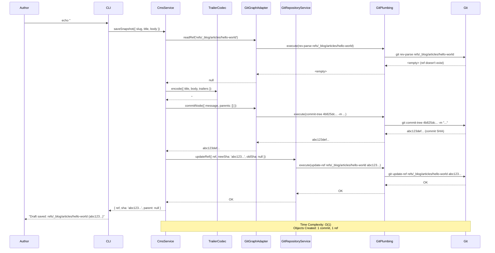

**Time Complexity:** O(1) – Single commit creation, single ref update.

**Git Objects Created:**
- 1 commit object (`abc123def...`)
- 1 ref (`refs/_blog/articles/hello-world`)

---

### Scenario 2: Publish Article

**Precondition:** Draft already exists at `refs/_blog/articles/hello-world`.

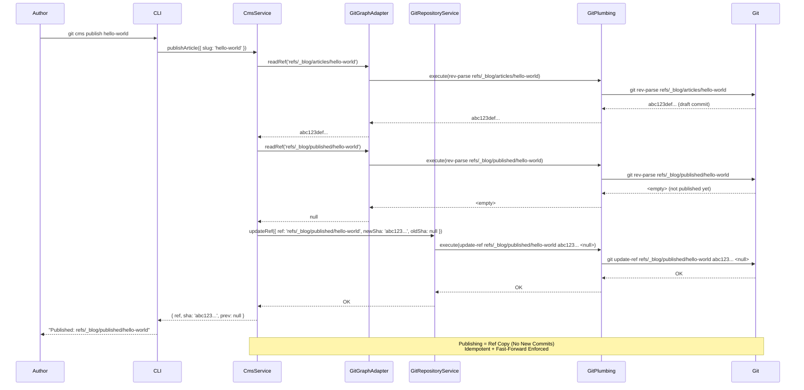

**Key Insight:** Publishing is **just a ref copy**. No new commits created. This is idempotent.

**Fast-Forward Enforcement:** If `oldSha` doesn't match (concurrent publish), Git's `update-ref` fails.

---

### Scenario 3: Upload Encrypted Asset

**Actors:** Author (HTTP), CmsService, CAS, Vault, GitPlumbing

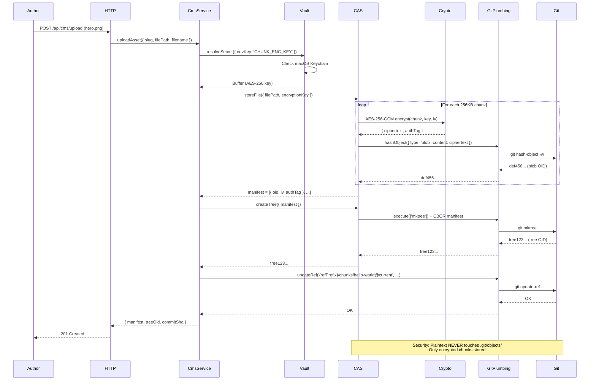

**Security Property:** The plaintext file never touches `.git/objects/`. Only encrypted chunks do.

---

### Scenario 4: List All Published Articles

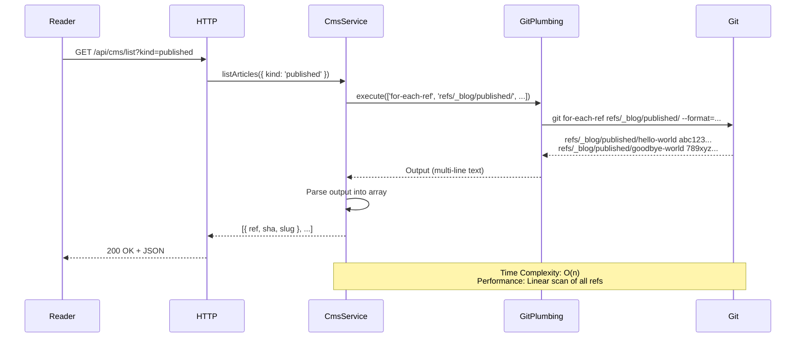

**Time Complexity:** O(n) where n = number of published articles.

**Performance Note:** Git's `for-each-ref` is linear. For 10,000 articles, this could be slow. Mitigation: build an external index (e.g., SQLite) that reads from Git log.

---

## 7. Deployment View

### Infrastructure Overview

git-cms is designed for **minimal infrastructure**. It can run as:
1. **Local CLI:** Direct Git operations on user's machine.
2. **HTTP Server:** Node.js process serving REST API + static HTML.
3. **Docker Container:** Isolated environment for testing or deployment.

### Deployment Topology

#### Topology 1: Single-Author Local Blog

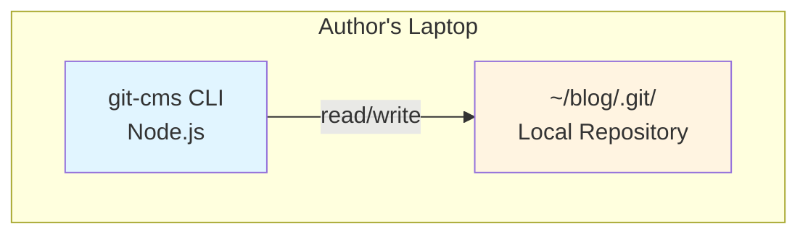

**Deployment Steps:**
```bash
# One-time setup (from your cloned git-cms repo):
# npm link

cd ~/blog
git init
echo "# My Post" | git cms draft my-post "Title"
git cms publish my-post
```

**No Server Required:** All operations are local Git commands.

---

#### Topology 2: Team Blog with Stargate Gateway

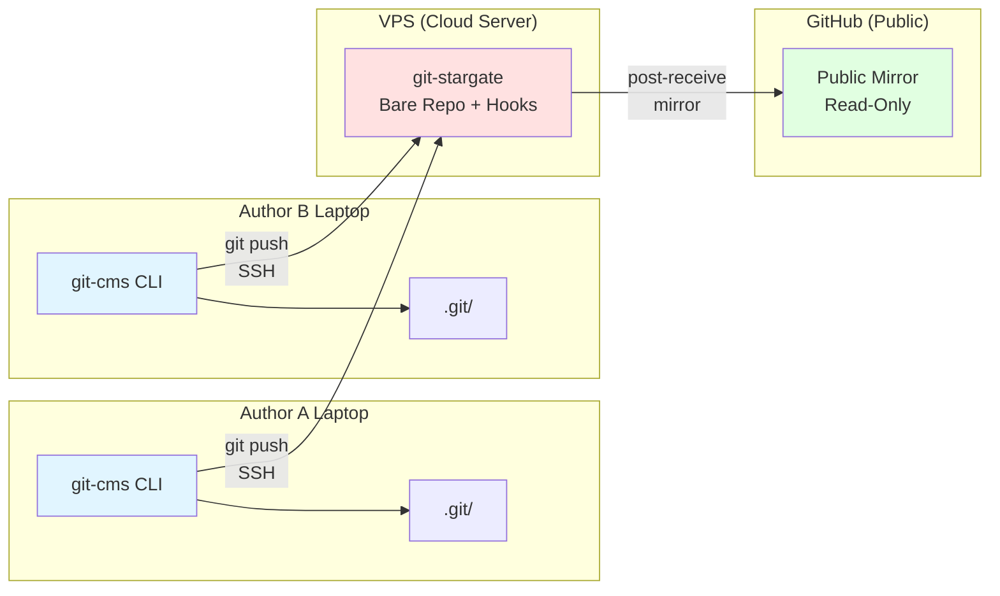

**Component Breakdown:**

1. **Author Laptops:**
   - Run `git-cms` CLI locally.
   - Push to `git-stargate` via SSH.

2. **git-stargate (VPS):**
   - Bare Git repository (`~/git/_blog-stargate.git`).
   - `pre-receive` hook enforces:
     - Fast-forward only (no `git push --force`).
     - GPG signature verification.
   - `post-receive` hook mirrors to GitHub.

3. **GitHub (Public Mirror):**
   - Read-only public clone.
   - CI/CD builds static site from `refs/_blog/published/*`.

**Deployment Steps:**
```bash
# On VPS (as git-cms user):
git init --bare ~/git/_blog-stargate.git
cd ~/git/_blog-stargate.git/hooks
# Install pre-receive and post-receive hooks from git-stargate repo

# On Author Laptop:
git remote add stargate git-cms@vps.example.com:~/git/_blog-stargate.git
git config remote.stargate.push "+refs/_blog/*:refs/_blog/*"
echo "# Post" | git cms draft my-post "Title"
git cms publish my-post
git push stargate
```

---

#### Topology 3: Dockerized Development

**File:** `docker-compose.yml`

```yaml
services:
  app:
    build:
      context: .
      target: dev
    ports:
      - "4638:4638"
    environment:
      - PORT=4638
      - GIT_CMS_ENV=dev
```

```mermaid
graph TB
    subgraph "Host Machine"
        DevMachine[Developer Workstation<br/>macOS/Linux/Windows]
        Browser[Web Browser<br/>http://localhost:4638]
    end

    subgraph "Docker Container (app)"
        NodeApp[Node.js 22<br/>git-cms HTTP Server]
        GitBin[Git CLI<br/>Plumbing Commands]
        Repo[/app/.git/<br/>In-Container Repo]

        NodeApp --> GitBin
        GitBin --> Repo
    end

    subgraph "Docker Container (test)"
        TestRunner[Vitest<br/>Test Suite]
        TempRepos[/tmp/test-repos/<br/>Temporary Git Repos]

        TestRunner --> TempRepos
    end

    DevMachine -->|docker compose up app| NodeApp
    Browser -->|HTTP:4638| NodeApp
    DevMachine -->|docker compose run test| TestRunner

    style NodeApp fill:#e1f5ff
    style TestRunner fill:#fff4e1
    style Repo fill:#ffe1e1
```

**Multi-Stage Dockerfile:**

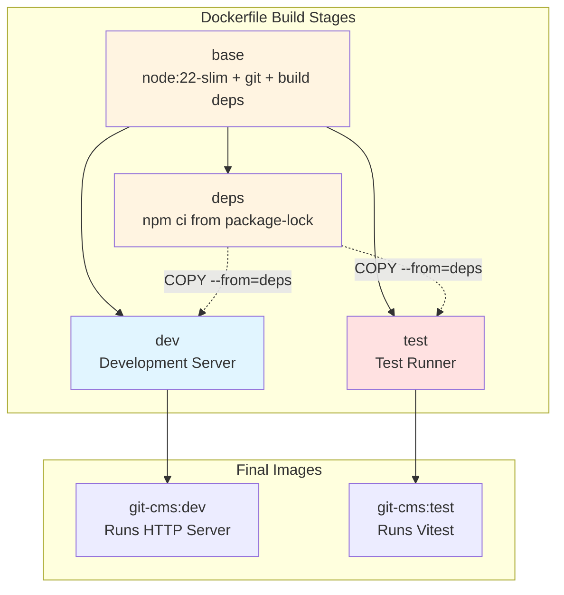

```dockerfile
# Base: Node 22 + Git + native build toolchain
FROM node:22-slim AS base
RUN apt-get update && apt-get install -y git python3 make g++

# Deps: Install dependencies
FROM base AS deps
COPY package.json package-lock.json* ./
RUN npm ci

# Dev: Development server
FROM base AS dev
ENV NODE_ENV=development
COPY --from=deps /app/node_modules ./node_modules
COPY . .
RUN git config --global user.email "dev@git-cms.local"
CMD ["npm", "run", "serve"]

# Test: Run tests in isolation
FROM base AS test
ENV NODE_ENV=test
COPY --from=deps /app/node_modules ./node_modules
COPY . .
CMD ["npm", "run", "test:local"]
```

**Deployment Steps:**
```bash
docker compose up app    # Start dev server on http://localhost:4638
docker compose run --rm test  # Run tests in isolated container
```

**Why Docker?**
- Ensures consistent Git version across dev/test/prod.
- Protects host filesystem from destructive Git operations.
- Simplifies CI/CD (just `docker compose run --rm test`).

---

### Resource Requirements

| Deployment Type | CPU | Memory | Disk | Network |
|----------------|-----|---------|------|---------|
| CLI (Local) | Negligible | <50MB | 100MB (`.git/objects`) | None |
| HTTP Server | 0.5 vCPU | 256MB | 100MB + repo size | 1Mbps |
| Docker Dev | 1 vCPU | 512MB | 1GB (includes Node + layers) | 10Mbps |

**Scaling Notes:**
- **Horizontal scaling:** Not applicable (single-writer constraint).
- **Vertical scaling:** Limited by Git performance (mostly I/O bound).

---

## 8. Crosscutting Concepts

### Concept 1: Merkle DAG as Event Log

**Pattern:** Every operation creates an immutable commit. The ref is a pointer to the "current" state.

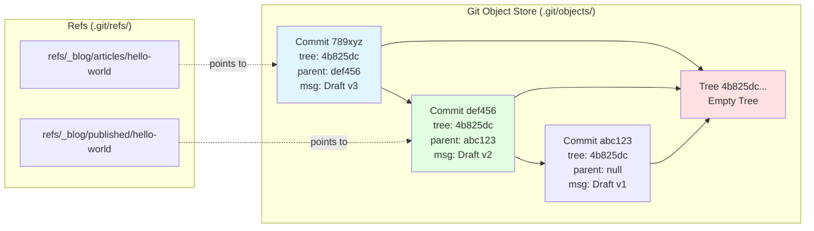

**Implementation:**
- Drafts: `refs/_blog/articles/<slug>` points to latest draft commit.
- Published: `refs/_blog/published/<slug>` points to published commit.
- History: `git log <ref>` shows all versions.

**Benefit:** Event sourcing without Kafka or Event Store.

---

### Concept 2: Compare-and-Swap (CAS) via `git update-ref`

**Problem:** Prevent concurrent writes from corrupting refs.

**Solution:** Use `git update-ref <ref> <newSHA> <expectedOldSHA>` for compare-and-swap semantics:

```bash
git update-ref refs/_blog/articles/hello-world <newSHA> <expectedOldSHA>
```

If `expectedOldSHA` doesn't match, Git returns exit code 1.

**Implementation:** `src/lib/CmsService.js` (`CmsService.updateRef` via `GitRepositoryService.updateRef`)

```javascript
await this.repo.updateRef({ ref, newSha, oldSha: parentSha });
```

**Concurrency Guarantee:** Atomic at the ref level (not across refs).

---

### Concept 3: Client-Side Encryption (Defense in Depth)

**Threat Model:** Untrusted Git gateway (e.g., compromised VPS).

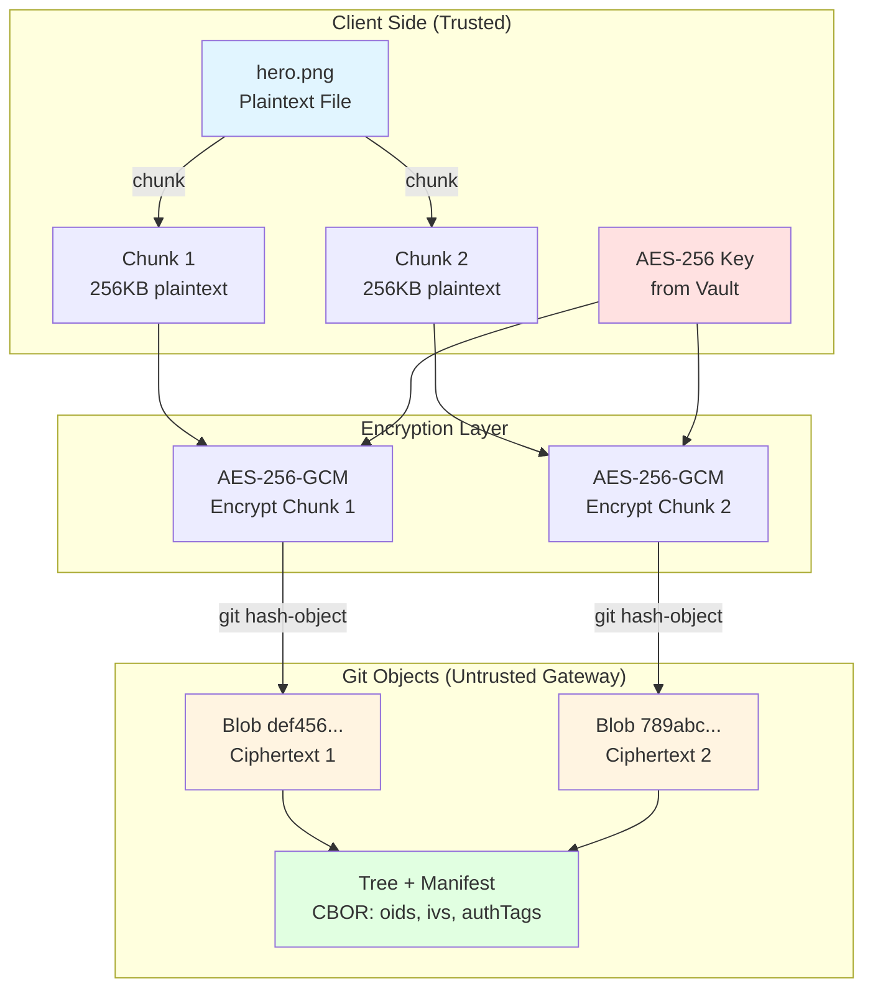

**Mitigation:**
1. **Encrypt on write:** Author's machine encrypts asset before `git push`.
2. **Decrypt on read:** Author's machine decrypts after `git pull`.

**Key Management:**
- Dev: `Vault` retrieves key from macOS Keychain.
- Prod: Key injected via env var (`CHUNK_ENC_KEY`).

**Cryptographic Primitive:** AES-256-GCM (authenticated encryption).

**Implementation:** `@git-stunts/git-cas/src/index.js`

```javascript
const cipher = crypto.createCipheriv('aes-256-gcm', encryptionKey, iv);
const encrypted = Buffer.concat([cipher.update(chunk), cipher.final()]);
const authTag = cipher.getAuthTag();
```

---

### Concept 4: Zero-Copy Streaming (Performance)

**Challenge:** Reading large commit logs without loading entire output into memory.

**Solution:** `@git-stunts/plumbing` uses async iterators:

```javascript
for await (const line of plumbing.logStream({ ref })) {
  console.log(line);
}
```

**Benefit:** Constant memory usage, even for repos with millions of commits.

---

### Concept 5: Trailer Normalization (Compatibility)

**Git's Behavior:** Trailer keys are case-insensitive (`Author` == `author`).

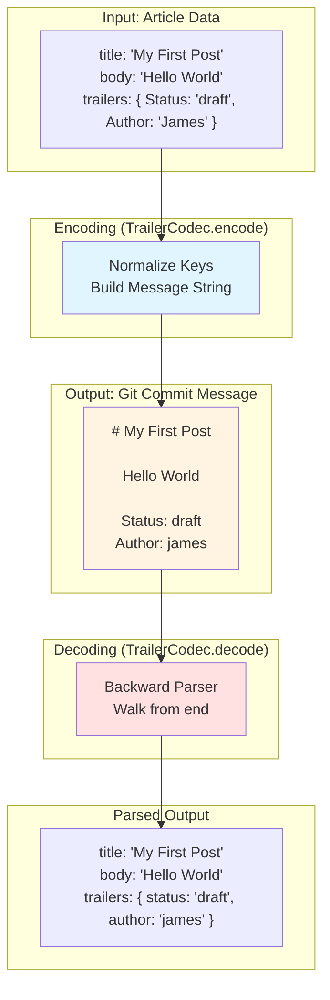

**Implementation:** `TrailerCodecService` lowercases all keys:

```javascript
normalizeTrailerKey(k) {
  return k.toLowerCase().replace(/-/g, '');
}
```

**Rationale:** Matches Git's own trailer normalization logic.

---

### Concept 6: Fail-Fast Validation (Security)

**Threat:** Malicious commit messages with oversized trailers (DoS).

**Mitigation:** Impose hard limits:

```javascript
const MAX_TRAILER_KEYS = 50;
const MAX_TRAILER_VALUE_LENGTH = 10_000;
```

**Enforcement:** `TrailerCodecService.decode()` throws if exceeded.

---

### Concept 7: Ubiquitous Language (DDD)

| Term | Definition |
|------|------------|
| **Article** | A blog post (title + body + metadata). |
| **Slug** | URL-friendly identifier (e.g., `hello-world`). |
| **Draft** | Unpublished version of an article. |
| **Published** | Article visible to readers. |
| **Snapshot** | A single version in the article's history. |
| **Trailer** | Key-value metadata (e.g., `Status: draft`). |
| **Empty Tree** | Git's canonical empty tree (SHA-1 mode: `4b825dc...`; use `git hash-object -t tree /dev/null` for the active object format). |
| **Lego Block** | Independent `@git-stunts/*` module. |

---

## 9. Architectural Decisions

### ADR-001: Use Commit Messages, Not Files

**Context:** Need to store articles in Git without polluting working directory.

**Decision:** Store articles as commit messages on the empty tree.

**Alternatives Considered:**
1. **Files in `posts/`:** Causes merge conflicts, clutters working tree.
2. **Git notes:** Harder to query, no parent pointers.
3. **Blobs in orphan branches:** No GPG signing support.

**Rationale:** Commit messages support:
- Linear history via parent pointers.
- GPG signing for non-repudiation.
- Human-readable `git log` output.

**Consequences:**
- ✅ Clean working directory.
- ✅ Full version history.
- ❌ Commit messages limited to ~100KB (Git's internal buffer).

**Status:** Accepted.

---

### ADR-002: Use RFC 822 Trailers, Not JSON

**Context:** Need structured metadata in commit messages.

**Decision:** Use RFC 822 trailers (e.g., `Status: draft`).

**Alternatives Considered:**
1. **JSON in message:** Not diff-friendly, requires escaping.
2. **YAML front matter:** Not Git-native, requires parser.

**Rationale:**
- Git already uses trailers (`Signed-off-by`, `Co-authored-by`).
- Human-readable and diff-friendly.
- Backward parser is more efficient than Git's own.

**Consequences:**
- ✅ Git-native format.
- ✅ Efficient parsing.
- ❌ Limited to key-value pairs (no nested objects).

**Status:** Accepted.

---

### ADR-003: Fast-Forward Only Publishing

**Context:** Prevent published content from being altered after release.

**Decision:** Publishing must be a fast-forward from draft to published ref.

**Alternatives Considered:**
1. **Allow force updates:** Breaks audit trail.
2. **Separate publish commit:** Creates duplicate content.

**Rationale:** Fast-forward guarantees:
- Published content is immutable.
- Provenance is verifiable.

**Enforcement:** `git-stargate` pre-receive hook rejects non-fast-forward pushes.

**Consequences:**
- ✅ Immutable publications.
- ❌ Cannot "unpublish" (must publish a new version with `Status: deleted`).

**Status:** Accepted.

---

### ADR-004: Client-Side Encryption for Assets

**Context:** Git gateways may be untrusted (e.g., hosted VPS).

**Decision:** Encrypt assets (AES-256-GCM) before `git push`.

**Alternatives Considered:**
1. **git-crypt:** Requires shared keys, all-or-nothing encryption.
2. **Server-side encryption:** Gateway sees plaintext.

**Rationale:**
- Row-level encryption (different keys per asset).
- Zero-trust gateway (only receives ciphertext).

**Consequences:**
- ✅ Defense in depth.
- ✅ Granular access control.
- ❌ Key management complexity.

**Status:** Accepted.

---

### ADR-005: Shell-Based Git Plumbing, Not libgit2

**Context:** Need Git operations in JavaScript.

**Decision:** Use `child_process.spawn` to call Git CLI.

**Alternatives Considered:**
1. **nodegit (libgit2):** Native dependencies, build complexity.
2. **isomorphic-git:** Pure JS, but incomplete (no GPG signing).

**Rationale:**
- Git CLI is stable, well-tested, and available everywhere.
- No native build dependencies.
- Multi-runtime support (Node, Bun, Deno).

**Consequences:**
- ✅ Zero native dependencies.
- ✅ Multi-runtime compatibility.
- ❌ Slower than libgit2 (process spawn overhead).

**Status:** Accepted.

---

## 10. Quality Requirements

### Quality Tree

```
git-cms Quality
├── Security (Critical)
│   ├── Cryptographic Integrity (Object Hash + GPG)
│   ├── Client-Side Encryption (AES-256-GCM)
│   └── DoS Protection (Trailer limits)
├── Simplicity (High)
│   ├── Zero Database Dependencies
│   ├── Composable Lego Blocks
│   └── Minimal Lines of Code
├── Auditability (High)
│   ├── Complete Provenance (Git log)
│   └── Trailer Metadata
├── Performance (Medium)
│   ├── Sub-Second Reads (<1s for typical blog)
│   └── Acceptable Writes (<5s for publish)
└── Portability (Medium)
    ├── Multi-Runtime (Node, Bun, Deno)
    └── Dockerized Tests
```

### Quality Scenarios

#### QS-1: Tamper Detection

**Scenario:** Attacker modifies published article on Git gateway.

**Stimulus:** Malicious `git filter-branch` rewriting history.

**Response:** Readers detect tampered commits via object-hash and ref-history mismatch.

**Metric:** 100% tamper detection (via Merkle DAG).

**Test:**
```bash
# Modify commit message
git filter-branch --msg-filter 'sed s/Original/Modified/'
# Push to reader's clone
git pull
# Reader's Git detects non-fast-forward (rejects)
```

---

#### QS-2: Encrypted Asset Confidentiality

**Scenario:** Untrusted gateway operator accesses repository.

**Stimulus:** Admin runs `git cat-file blob <oid>` on encrypted chunk.

**Response:** Only ciphertext visible (plaintext unrecoverable without key).

**Metric:** 0% plaintext leakage.

**Test:**
```bash
# Upload encrypted asset via HTTP API
curl -X POST http://localhost:4638/api/cms/upload \
  -H 'Content-Type: application/json' \
  -d '{"slug":"hello-world","filename":"hero.png","data":"<base64>"}'
# Admin views blob
git cat-file blob abc123...
# Output: Binary garbage (AES-256-GCM ciphertext)
```

---

#### QS-3: Concurrent Publish Conflict

**Scenario:** Two authors publish the same article simultaneously.

**Stimulus:** Author A and B both run `git cms publish my-post` at T=0.

**Response:** One succeeds, one fails with "ref update rejected."

**Metric:** 100% consistency (no lost updates).

**Test:**
```bash
# Author A
git cms publish my-post &
# Author B (concurrent)
git cms publish my-post &
# One sees: "Published"
# Other sees: "Error: ref update failed (old SHA mismatch)"
```

---

#### QS-4: Large Repository Performance

**Scenario:** Blog with 10,000 published articles.

**Stimulus:** Reader requests `GET /api/cms/list?kind=published`.

**Response:** API responds in <2 seconds.

**Metric:** 95th percentile latency <2s.

**Bottleneck:** `git for-each-ref` is O(n).

**Mitigation:** Build external index (e.g., SQLite) in post-receive hook.

---

#### QS-5: Docker Test Isolation

**Scenario:** Developer runs `npm test` on host machine.

**Stimulus:** Test creates temporary Git repos in `/tmp`.

**Response:** Test script aborts with "Run tests in Docker!"

**Metric:** 0% risk of host filesystem corruption.

**Enforcement:** `test/run-docker.sh` checks for Docker environment.

---

## 11. Risks & Technical Debt

### Risk 1: SHA-1 Collision Vulnerability

**Severity:** Medium
**Likelihood:** Low (but increasing)

**Description:** Git uses SHA-1 for object addressing. SHA-1 is cryptographically broken (SHAttered attack, 2017).

**Impact:** Attackers could craft colliding commits to inject malicious content.

**Mitigation:**
1. **Short-term:** Use GPG signing (`CMS_SIGN=1`) for non-repudiation.
2. **Long-term:** Migrate to Git's SHA-256 mode (available in Git 2.29+).

**Status:** Monitored.

---

### Risk 2: Repository Growth (Unbounded)

**Severity:** High
**Likelihood:** High (for active blogs)

**Description:** Every draft save creates a commit. Over time, `.git/objects/` grows unbounded.

**Impact:** Slow clones, high disk usage.

**Mitigation:**
1. **Aggressive GC:** Run `git gc --aggressive` weekly.
2. **Ref Pruning:** Delete old draft refs (keep only last N versions).
3. **Shallow Clones:** Readers use `git clone --depth=1`.

**Technical Debt:** No automated pruning implemented yet.

**Status:** Unresolved.

---

### Risk 3: Concurrent Write Conflicts

**Severity:** Medium
**Likelihood:** Medium (multi-author blogs)

**Description:** Git's CAS (compare-and-swap) is per-ref, not global. Two authors can create conflicting drafts.

**Impact:** Lost updates, user frustration.

**Mitigation:**
1. **git-stargate:** Serialize writes via SSH (single-writer gateway).
2. **Retry Logic:** Client retries `updateRef` on conflict.

**Technical Debt:** No retry logic in CmsService.

**Status:** Partially mitigated.

---

### Risk 4: Commit Message Size Limit

**Severity:** Low
**Likelihood:** Low

**Description:** Git's `commit-tree` buffers messages in memory (~100KB limit).

**Impact:** Very long articles (>50,000 words) may fail to save.

**Mitigation:** Split long articles into multiple parts (e.g., chapters).

**Technical Debt:** No validation of message size.

**Status:** Accepted risk.

---

### Risk 5: GDPR Right to Erasure

**Severity:** High (for EU users)
**Likelihood:** Medium

**Description:** Git's immutability conflicts with GDPR Article 17 (right to be forgotten).

**Impact:** Cannot delete historical commits without rewriting history (breaks Merkle DAG).

**Mitigation:**
1. **Encryption:** Delete encryption key instead of commits.
2. **Legal:** Argue "legitimate interest" (journalistic records).

**Technical Debt:** No automated key rotation.

**Status:** Legal review pending.

---

### Technical Debt Summary

| Item | Priority | Effort | Impact |
|------|---------|--------|--------|
| Implement automated ref pruning | High | Medium | Reduces repo growth |
| Add retry logic to CmsService | Medium | Low | Improves concurrency |
| Validate commit message size | Low | Low | Prevents edge-case failures |
| Migrate to SHA-256 | Low | High | Future-proofs cryptography |
| Build external index for `listArticles` | Medium | High | Scales to 10,000+ articles |

---

## 12. Glossary

### A

**AES-256-GCM:** Advanced Encryption Standard with 256-bit keys in Galois/Counter Mode. Provides authenticated encryption (confidentiality + integrity).

**Append-Only Ledger:** A data structure where records can only be added, never modified or deleted. Git's commit history is an append-only ledger.

**Atomic Operation:** An operation that either completes fully or not at all (no partial states). Git's `update-ref` is atomic at the ref level.

### B

**Bare Repository:** A Git repository without a working directory (only `.git/` contents). Used for servers/gateways.

**Blob:** A Git object type storing raw file content. Identified by object-format hash of content (SHA-1 default, SHA-256 in SHA-256 repos).

### C

**CAS (Compare-and-Swap):** A concurrency primitive ensuring a value is updated only if it matches an expected old value. Git's `update-ref` uses CAS semantics.

**CAS (Content-Addressable Store):** A storage system where data is retrieved by its cryptographic hash, not by location. Git is a CAS.

**Chunking:** Splitting large files into fixed-size pieces (e.g., 256KB). Enables streaming and deduplication.

**Commit:** A Git object representing a snapshot of the repository at a point in time. Contains tree, parent(s), author, message.

**Ciphertext:** Encrypted data. Unreadable without the decryption key.

### D

**DAG (Directed Acyclic Graph):** A graph with directed edges and no cycles. Git's commit history is a DAG (parent pointers form edges).

**Draft:** An unpublished version of an article, stored at `refs/_blog/articles/<slug>`.

### E

**Empty Tree:** Git's canonical empty tree object. In SHA-1 mode: `4b825dc642cb6eb9a060e54bf8d69288fbee4904`; for other formats compute with `git hash-object -t tree /dev/null`.

**Event Sourcing:** An architectural pattern where state changes are stored as a sequence of events. Git commits are events.

### F

**Fast-Forward:** A Git merge where the target ref simply moves forward (no merge commit). Requires linear history.

### G

**GPG (GNU Privacy Guard):** Open-source implementation of OpenPGP. Used for signing Git commits.

### H

**Hexagonal Architecture:** A software design pattern separating domain logic from infrastructure (also called "Ports and Adapters").

**HMAC (Hash-based Message Authentication Code):** A cryptographic construction for verifying integrity and authenticity.

### I

**Immutability:** Property of data that cannot be changed after creation. Git objects are immutable (identified by hash of content).

### K

**Keychain:** OS-level secure storage for secrets (passwords, encryption keys). Examples: macOS Keychain, GNOME Keyring.

### L

**Lego Block:** In this project, an independent `@git-stunts/*` module with a single responsibility (plumbing, codec, CAS, vault, git-warp).

### M

**Merkle DAG:** A Directed Acyclic Graph where each node is identified by a cryptographic hash of its contents and children. Git's object model is a Merkle DAG.

**Manifest:** A metadata structure describing chunked file layout. Contains OIDs, IVs, and auth tags for encrypted chunks.

### N

**Namespace:** A prefix for Git refs to avoid collisions. Example: `refs/_blog/articles/` vs `refs/_blog/published/`.

**Non-Repudiation:** Property where the author of a message cannot deny authorship. Achieved via GPG signing.

### O

**OID (Object Identifier):** Git's object-format hash of an object (commit, tree, blob, tag). SHA-1 in default mode, SHA-256 in SHA-256 repos.

**Orphan Branch:** A Git branch with no parent commits (disconnected from main history).

### P

**Plumbing:** Git's low-level commands (`commit-tree`, `update-ref`) vs. high-level "porcelain" commands (`commit`, `push`).

**Porcelain:** Git's user-friendly commands (`commit`, `push`, `pull`) built on top of plumbing.

**Provenance:** The origin and history of an artifact. Git provides cryptographic provenance via commit chains.

**Published:** An article visible to readers, stored at `refs/_blog/published/<slug>`.

### R

**Ref (Reference):** A pointer to a commit (e.g., `refs/heads/main`, `refs/tags/v1.0`).

**RFC 822:** Internet Message Format standard. Used for email headers and Git trailers.

### S

**SHA-1:** Secure Hash Algorithm 1. Produces 160-bit (40-character hex) hashes. It remains common in Git, but SHA-256 mode is the migration target.

**SHA-256:** Secure Hash Algorithm 2 (256-bit variant). Git's future default.

**Slug:** A URL-friendly identifier (lowercase, hyphens, no spaces). Example: `hello-world`.

**Snapshot:** A single version in an article's history (represented as a Git commit).

### T

**Trailer:** Key-value metadata at the end of a Git commit message. Example: `Status: draft`.

**Tree:** A Git object representing a directory (mapping filenames → blob OIDs or subtree OIDs).

### U

**Ubiquitous Language:** Domain-Driven Design term for a shared vocabulary between developers and domain experts.

### V

**Vault:** In this project, the `@git-stunts/vault` module for retrieving secrets from OS keychains.

---

## Appendix A: Example Commands

### Draft an Article
```bash
echo "# My First Post" | git cms draft hello-world "My First Post"
```

### Publish an Article
```bash
git cms publish hello-world
```

### List All Drafts
```bash
git cms list
```

### List All Published
```bash
curl "http://localhost:4638/api/cms/list?kind=published"
```

### Read an Article
```bash
git cms show hello-world
```

### Upload Encrypted Asset
```bash
curl -X POST http://localhost:4638/api/cms/upload \
  -H 'Content-Type: application/json' \
  -d '{"slug":"hello-world","filename":"hero.png","data":"<base64>"}'
```

### Start HTTP Server
```bash
git cms serve
# → Listening on http://localhost:4638
```

---

## Appendix B: Directory Structure

```
git-cms/
├── bin/
│   └── git-cms.js              # CLI entry point
├── src/
│   ├── lib/
│   │   └── CmsService.js       # Core orchestrator
│   └── server/
│       └── index.js            # HTTP API server
├── test/
│   ├── git.test.js             # Integration tests (Vitest)
│   ├── chunks.test.js          # Asset encryption tests
│   ├── server.test.js          # API tests
│   └── e2e/                    # Playwright tests
│       └── publish.spec.js
├── public/                      # Static admin UI (vanilla JS)
│   ├── index.html
│   └── app.js
├── docs/
│   ├── GETTING_STARTED.md
│   ├── CONTENT_ID_POLICY.md
│   ├── LAYOUT_SPEC.md
│   └── ADR.md                  # This document
├── Dockerfile                  # Multi-stage build
├── docker-compose.yml          # Dev/test orchestration
├── package.json                # Dependencies
└── README.md                   # Overview
```

---

## Appendix C: Related Projects

### git-stargate

**URL:** [https://github.com/flyingrobots/git-stargate](https://github.com/flyingrobots/git-stargate)
**Purpose:** Git gateway enforcing fast-forward only, GPG signing, and public mirroring.

### git-stunts (Lego Blocks)

**URL:** [https://github.com/flyingrobots/git-stunts](https://github.com/flyingrobots/git-stunts)
**Modules:**
- `@git-stunts/plumbing` – Low-level Git protocol wrapper
- `@git-stunts/trailer-codec` – RFC 822 trailer parser
- `@git-stunts/git-warp` – Graph database primitive
- `@git-stunts/git-cas` – Content-addressable store with encryption
- `@git-stunts/vault` – OS keychain integration

---

## Appendix D: References

1. **Git Internals (Pro Git Book):** [https://git-scm.com/book/en/v2/Git-Internals-Plumbing-and-Porcelain](https://git-scm.com/book/en/v2/Git-Internals-Plumbing-and-Porcelain)
2. **RFC 5322 (Internet Message Format):** [https://tools.ietf.org/html/rfc5322](https://tools.ietf.org/html/rfc5322)
3. **Git Trailers Documentation:** [https://git-scm.com/docs/git-interpret-trailers](https://git-scm.com/docs/git-interpret-trailers)
4. **AES-GCM (NIST SP 800-38D):** [https://csrc.nist.gov/publications/detail/sp/800-38d/final](https://csrc.nist.gov/publications/detail/sp/800-38d/final)
5. **Event Sourcing (Martin Fowler):** [https://martinfowler.com/eaaDev/EventSourcing.html](https://martinfowler.com/eaaDev/EventSourcing.html)
6. **Hexagonal Architecture:** [https://alistair.cockburn.us/hexagonal-architecture/](https://alistair.cockburn.us/hexagonal-architecture/)

---

## Conclusion

**git-cms** demonstrates that Git's plumbing can be repurposed to build systems that shouldn't exist—yet do so elegantly. By treating commits as database records, refs as indexes, and the Merkle DAG as an audit log, we've created a CMS with cryptographic integrity, infinite history, and zero database dependencies.

This architecture is not "production-ready" in the traditional sense. It violates assumptions about databases, scalability, and best practices. But it teaches us to think differently about constraints, to see tools for what they truly are, and to respect the power of simple primitives composed thoughtfully.

If Linus saw this, he'd probably sigh, shake his head, and mutter: *"You know what? Have fun."*

And we are.

---

**End of Document**
